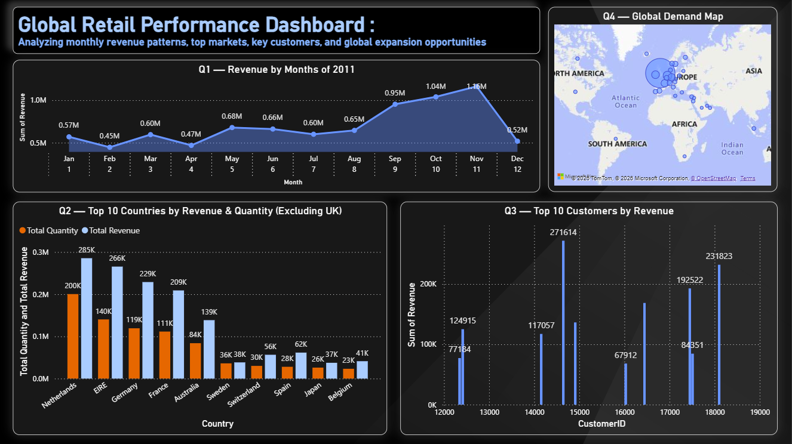

# tata-data-visualisation-forage
Power BI dashboard analyzing global retail performance — Tata × Forage Job Simulation
# 📊 Global Retail Performance Dashboard
### Tata Data Visualisation: Empowering Business with Effective Insights
**Forage Job Simulation — April 2026**

---

[](https://forage-uploads-prod.s3.amazonaws.com/completion-certificates/)


---

## 🧭 Project Overview

This project was completed as part of **Tata Consultancy Services' Data Visualisation Job Simulation** on the Forage platform. The objective was to act as a data analyst at TCS, helping a retail client make sense of their 2011 transactional data to support executive-level decision-making.

The deliverables included:
- Framing business questions for **CEO & CMO** stakeholders
- Cleaning and analyzing an **Online Retail dataset**
- Building a **4-panel Power BI dashboard** to communicate key insights

---

## 🗂️ Repository Structure

```
📦 tata-data-visualisation/
├── 📊 Online_Retail_Data_Set.xlsx       # Raw transactional dataset
├── 📈 Online_Retail.pbix                # Power BI Dashboard file
├── 🖼️  Dashboard_Screenshot.png         # Dashboard preview
├── ❓ Questions_CEO_CMO.md              # Business questions prepared for leadership
└── 📄 README.md                         # You are here
```

---

## 📸 Dashboard Preview



> **4-panel Power BI dashboard** analyzing monthly revenue, top markets, key customers, and global demand.

---

## ❓ Business Questions Prepared for Leadership

Before building the visuals, I framed the right questions to ensure the dashboard addressed real executive concerns.

### For the CEO
| # | Question |
|---|----------|
| 1 | Which months showed revenue growth and which declined — and why? |
| 2 | Are we too dependent on one market? |
| 3 | How many customers bought more than once — are we building loyalty or just one-time sales? |
| 4 | How much revenue is being lost to returns and cancellations — is it growing? |

### For the CMO
| # | Question |
|---|----------|
| 1 | What are our top 10 revenue-generating products — are we promoting them enough? |
| 2 | Is there a spike in sales during specific months — does it match our campaign calendar? |
| 3 | Which customer segment buys most frequently — are we marketing to the right people? |
| 4 | How many customers bought last year but haven't returned — what's our churn rate? |

---

## 📊 Dashboard Breakdown

### Q1 — Revenue by Month (2011)
A line chart tracking monthly revenue across the full year.

- 📈 **Strong growth**: Sep (£0.95M) → Oct (£1.04M) → Nov (£1.16M) — peak season
- 📉 **Decline**: Dec dropped sharply to £0.52M — likely early order cut-offs
- Lowest months: Feb (£0.45M) and Apr (£0.47M)

### Q2 — Top 10 Countries by Revenue & Quantity *(Excluding UK)*
A dual-axis bar chart comparing total revenue vs. quantity sold per country.

- 🥇 **Netherlands** leads in both revenue (£285K) and volume (200K units)
- 🥈 **EIRE** and **Germany** follow closely
- High-volume, lower-revenue markets like **France** signal pricing opportunities

### Q3 — Top 10 Customers by Revenue
A bar chart identifying the highest-value customers by CustomerID.

- Top customer (ID: **14646**) generated **£271,614**
- Significant revenue concentration in a small group → strong retention value
- Helps identify VIP customers for loyalty programs

### Q4 — Global Demand Map
An interactive map showing geographic spread of orders (excluding UK home market).

- Demand is heavily concentrated in **Western Europe**
- Opportunity to expand into **Asia, North America, and Australia**
- Bubble size = order volume per region

---

## 🛠️ Tools & Skills Used

| Category | Details |
|----------|---------|
| **Visualisation** | Microsoft Power BI |
| **Data** | Microsoft Excel (.xlsx) |
| **Skills** | Data Cleaning, Dashboard Development, Data Interpretation, Effective Communication |
| **Methodology** | Business scenario framing → Visual selection → Insight communication |

---

## 🏅 Certificate of Completion

**Kalpesh Nankar** — Tata Data Visualisation: Empowering Business with Effective Insights  
📅 Completed: **April 15, 2026**  
🔖 Issued by: **Forage**

**Modules Completed:**
- ✅ Framing the Business Scenario
- ✅ Choosing the Right Visuals
- ✅ Creating Effective Visuals
- ✅ Communicating Insights and Analysis

> Enrolment Verification Code: `c2AcjJmG4B3DDKw69`

---

## 💡 Key Insights Summary

1. **Revenue peaks in Q4** (Sep–Nov), with a sharp December dip — seasonal strategy needed
2. **UK dominates** total revenue; international expansion is underexplored
3. **Top 10 customers** contribute disproportionately — a retention program could have outsized ROI
4. **Netherlands and EIRE** are the strongest non-UK markets and deserve focused marketing

---

## 🔗 Connect

**Kalpesh Nankar**  
[](https://linkedin.com)

---
*This project was completed as part of a virtual job simulation and is intended for portfolio and learning purposes.*
